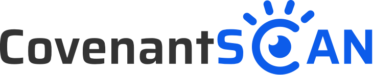

<p align="center">
    
</p>
<p align="center">

## Background

CovenantScan is CovenantSQL's main chain explorer, mainly provides chain status, block producers status, blocks and transactions, etc. [cqli](https://github.com/CovenantSQL/cql.js) acts as an interactive client for the chain in CovenantScan.

## Development

For local development:
- `yarn install`
- `yarn dev`

## Deployment

CovenantScan now is runing as a single page application host on Github Page, run ship script as following for deployment.

```
./ship.sh
```

## Credit & License 
Credit goes to handy [VueJS](https://github.com/vuejs) and its ecosystem.

MIT